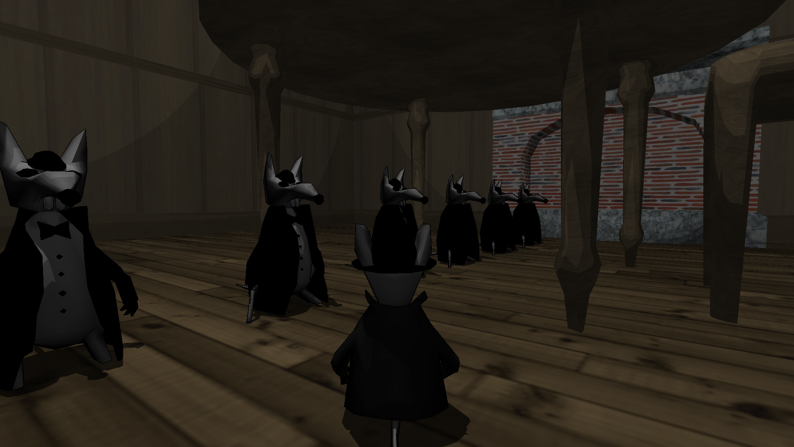

# All In A Mouse's Night

## Screenshot

## Description

This is a small project I developed some years ago. It is an attempt to make a 3D game.
The main character is a mouse, that lives in a world infested by rats.
The project never reached a usable state, but the main character is controllable and parts of the game can be scripted.
Missing parts are: inverse kinematics for the mouse to aim and shoot and all the data for the maps and story.

## Technical details

The game engine uses OpenGL 1.4 as my GPU at the time of development only supported this version.
It is by today's standards rather outdated, so I would not recommend using this engine as a starting point for a new game.
On the graphics side, I still managed to get some interesting effects, such as:

- Stencil shadows (with shadow volume extrusion on the GPU)
- Toon shading (per pixel! -- an achievement obtained using ARB assembly shaders)
- Contours (using a two pass line rendering algorithm)

Even though the provided data files do not contain a collision information for the map
(and consequently, you are able to go through objects -- but not through players), the game supports collision detection for the environment as well.
There is a second map that displays this feature, you can enable it by renaming `base/maps1.zip` into `base/map3.zip`.

## Build intructions

You will need CMake, SDL, FreeType, Lua, Libjpeg, libpng, and zlib.
The project should compile on Linux & Windows, but I will only list the instructions for a Linux installation here:

    mkdir build
    cd build
    cmake ..
    make -j

Once the project is compiled, copy the binary in the main directory and enjoy!

## Controls

Mouse to aim, and WASD to move, ESC to display the in-game menu with an awesome OpenGL-accelerated UI.
